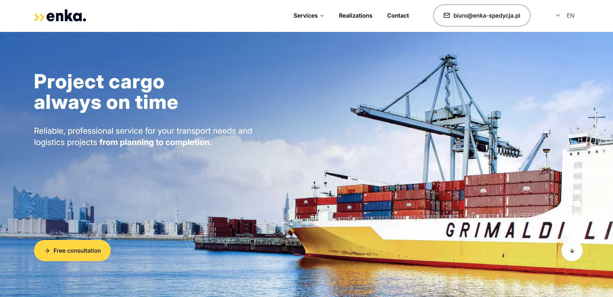

# Enka Shipping Website

Explore this multilingual company website built with next-js framework and shadcn/ui components.

[See the website live.](https://enka-shipping.vercel.app/)

## Table of Contents

- [Enka Shipping Website](#enka-shipping-website)
  - [Table of Contents](#table-of-contents)
  - [General Info](#general-info)
  - [Setup](#setup)
  - [Features](#features)
  - [Technologies](#technologies)
  - [Contact](#contact)

## General Info

The Enka Shipping website is a commercial project for a shipping company. The main goal was to re-design, prepare support for multiple language versions, and improve performance and accessibility metrics relative to the previous version of the site, prepared using generative artificial iteligence on the Durable platform.

## Setup

The project uses [Node](https://nodejs.org/en/) and [PNPM](https://pnpm.io/). To run the app on your machine you should install all dependencies. Then create a developer build on a localhost port and run your web explorer.

Clone repository

```
git clone https://github.com/M-Mikos/enka-shipping.git
```

Install dependencies

```
pnpm install
```

Go live with developer build

```
pnpm dev
```

Enka Shipping website is ready at port 3000.

```
localhost:3000/
```

## Features

- SPA functionality with server site rendering
- Custom lightbox gallery built with shadcn/ui dialog and carousel components
- Responsive layout based on TailwindCSS v4 and adaptive REM units definition
- Language verions suppors based on next-intl library
- Sticky header
- Drawer menu on mobile devices
- Media lazy loading
- Components dynamic loading

## Technologies

- [Next.js with App Router](https://vitejs.dev/) - Setting up dev environment
- [Tailwind CSS v4.0](https://www.typescriptlang.org/)
- [shadcn/ui](https://ui.shadcn.com/) - Set of UI components based on Radix primitives
- [Vercel](https://vercel.com) - Cloud infrastructure and developer tools
- [PageSpeed Insights]() - User experience metrics checker based on Lighthouse tool

---

## Contact

Design & code by [Marcin Mikos](mailto:mikos.marcin.m@gmail.com) - feel free to contact me!
